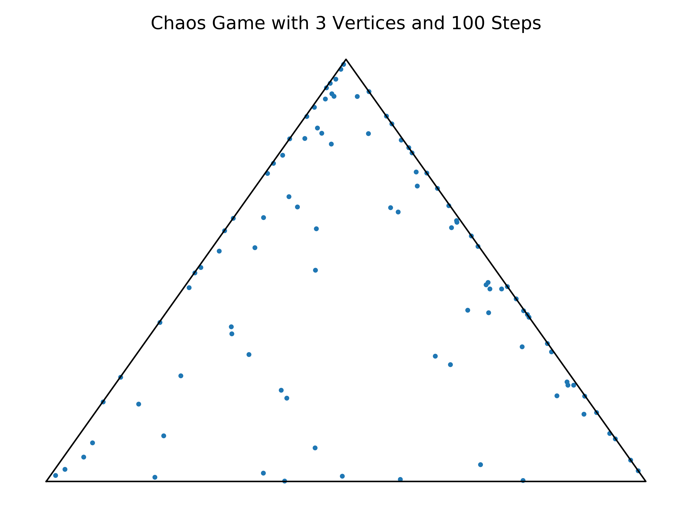

# ChaosGame
I originally saw a [Numberphile](https://youtu.be/kbKtFN71Lfs) video about the [Chaos Game](https://en.wikipedia.org/wiki/Chaos_game) on YouTube. Rules: a starting point is chosen, after which a vertex is selected at random, and the distance between the current point and the vertex is halved for the new location. The points created a [Sierpiński triangle](https://en.wikipedia.org/wiki/Sierpi%C5%84ski_triangle)--a triangular fractal. I wrote the code for this in Python and used Matplotlib to create the visuals. Animating and exporting the plot as a gif proved to be challenging, but I will use what I learned for future animated projects. My code for this project can be found on my GitHub here.

## Images
The more dots used, the closer the image looks to a Sierpiński triangle. Below are images created using various number of dots.

